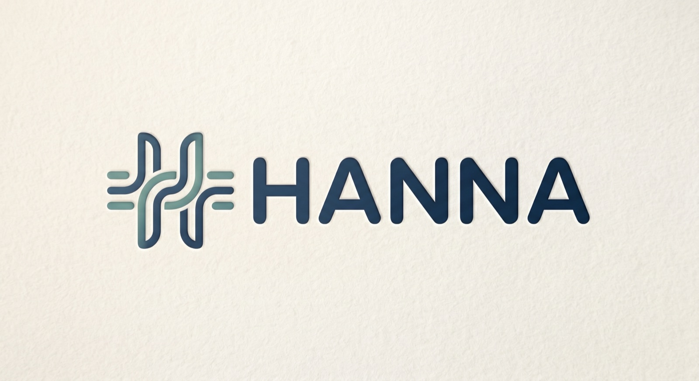
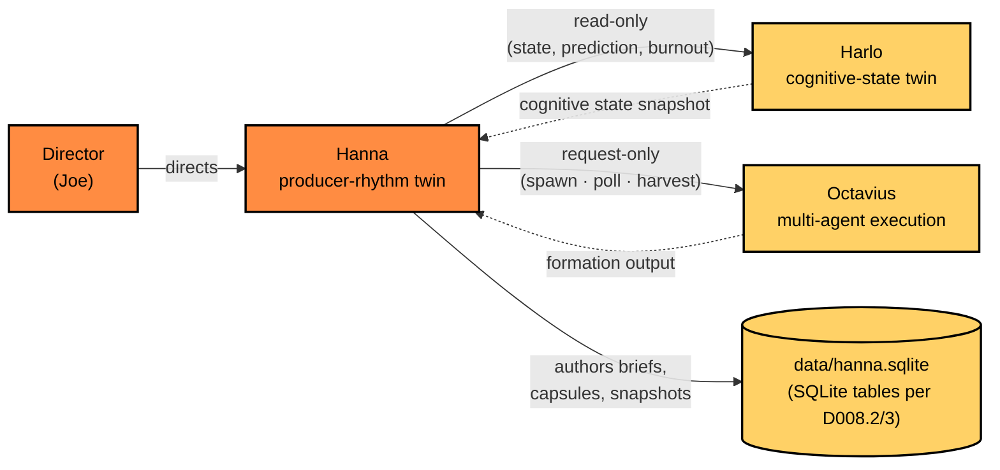
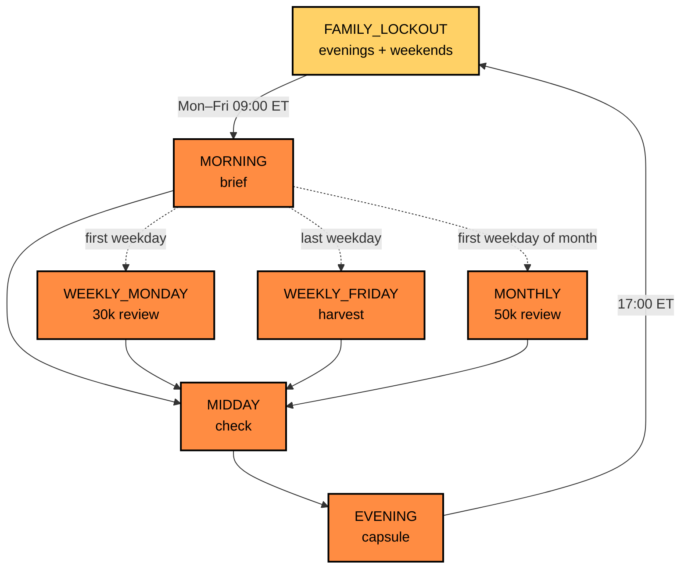
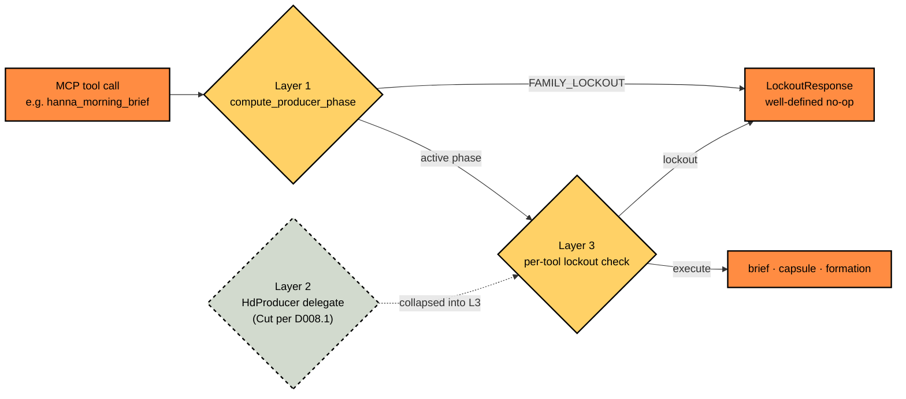
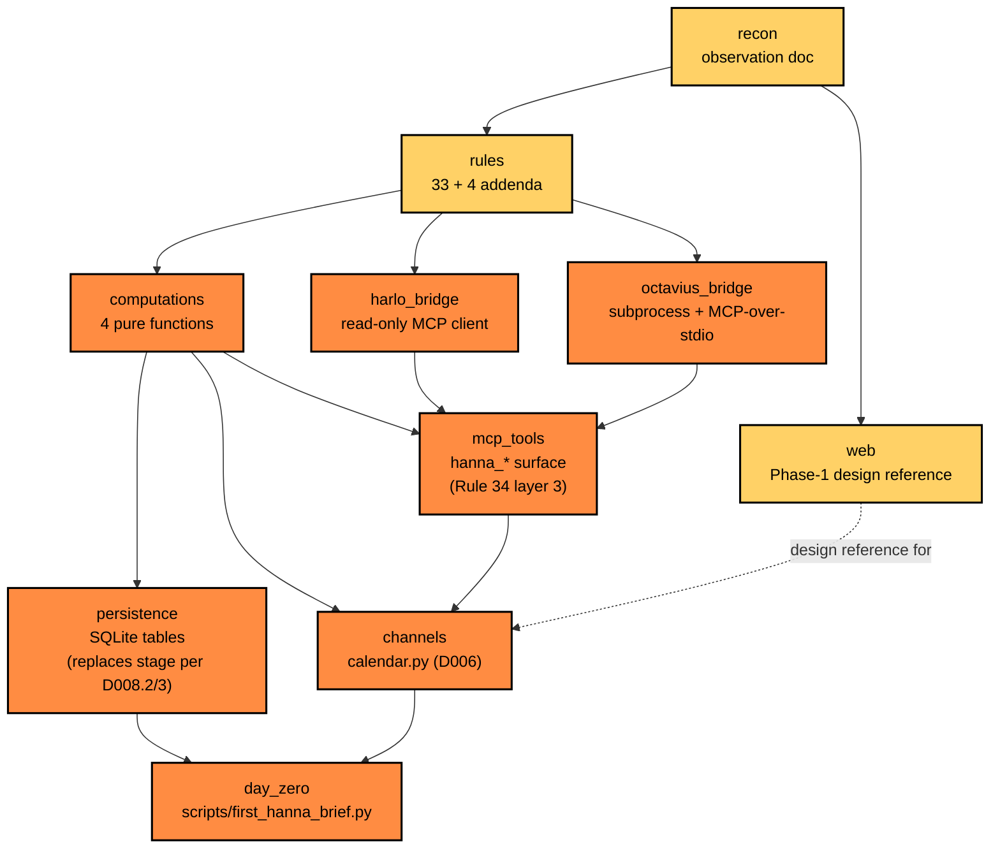

<h1 align="center">
  
</h1>

<p align="center"><em>Always-on AI producer for a creative portfolio. <strong>Surfaces decisions; does not make them.</strong></em></p>

Hanna is a producer-rhythm twin: it tracks what's in-flight, what's blocking, and what's approaching across an active portfolio of products. It runs on daily and weekly cadences (morning brief, midday check, evening capsule, Monday 30k, Friday harvest, monthly 50k), and coordinates multi-agent execution on-demand. **Family time is a structural constraint, not a setting.**

The architectural spec is [`HANNA_BLUEPRINT.md`](HANNA_BLUEPRINT.md). The inviolable rules — 33 inherited from [Harlo](https://github.com/JosephOIbrahim/Harlo) plus 4 producer-specific addenda — are in [`RULES.md`](RULES.md). Day-to-day conventions accrete in [`docs/CONVENTIONS.md`](docs/CONVENTIONS.md).

---

## How it relates to Harlo and Octavius

Each substrate stays single-purpose. Hanna **reads** Harlo (cognitive-state truth) and **requests** Octavius (multi-agent execution). Hanna writes only to its own stage.



**Edges are one-way and contractual.** `src/harlo_bridge.py` exposes only `read_state`, `read_prediction`, `read_burnout_level`. `src/octavius_bridge.py` exposes only `spawn_formation`, `formation_status`, `formation_output`. Anything beyond these contracts is a rule violation (see [`RULES.md`](RULES.md) §35).

---

## Producer phases

Hanna's daily and weekly rhythm is a state machine. `compute_producer_phase` is the single source of truth — every MCP tool checks phase before executing.



Phases outside Mon–Fri 09:00–17:00 ET resolve to `FAMILY_LOCKOUT`. Briefs and formation requests do not generate during lockout — they return a structured `LockoutResponse`, never an error.

---

## Family-first as architectural primitive

Family time is enforced at **two active layers** (Layer 2 — `HdProducer` delegate — was cut per [D008.1](docs/DECISIONS.md); layer numbering preserved for backward reference). Bypassing either layer fails CI.



Override exists for true exceptions — explicit `override_token`, HMAC-signed, single-use, TTL-bounded. It is a deliberate friction surface, not a flag. See [`RULES.md`](RULES.md) §34 for the full enforcement spec.

---

## Build lanes

Hanna is built in lanes. Lanes may be parallelized across sessions after recon and scaffold complete. **Yellow = landed. Orange = in flight or scheduled.** Lane execution is governed by [`docs/ROADMAP.md`](docs/ROADMAP.md) §5; the [`/hanna-dispatch-next`](.claude/commands/hanna-dispatch-next.md) harness advances one lane per invocation. `delegate` and `stage` lanes are Cut per [D008](docs/DECISIONS.md) (delegate collapsed into `mcp_tools` layer 3; stage reduced to SQLite tables).



**Day-zero deliverable:** `scripts/first_hanna_brief.py` boots Hanna, reads Joe's state from Harlo, computes producer phase, ranks brief priority across portfolio products, persists the brief to `data/hanna.sqlite` (per [D008.2/3](docs/DECISIONS.md), SQLite tables replace the cut USD stage), and returns the brief to stdout. *If that script runs, Hanna is real. The rest is iteration.*

---

## Rules

Hanna inherits Harlo's substrate verbatim, including the **33 inviolable rules** (biological constraints, elenchus constraints, inquiry safeguards, motor cortex constraints) and **8 inquiry safeguards**. Producer-specific addenda extend the set:

- **Rule 34** — Family-first lockout at three layers (above).
- **Rule 35** — Cross-substrate writes prohibited. Harlo edge is read-only; Octavius edge is request-only.
- **Rule 36** — Surface, do not decide. Every output is framed as a surfaced decision.
- **Rule 37** — Hard subject-matter prohibitions. See [`RULES.md`](RULES.md).

Full text: [`RULES.md`](RULES.md). Compliance grep recipes ship at the bottom of that file.

---

## Repository layout

```
HANNA_BLUEPRINT.md          architectural spec (v0.1.0-draft)
RULES.md                    33 inviolable rules + 8 safeguards + 4 addenda
CLAUDE.md                   project-local AI collaboration instructions
NEXT.md                     end-of-day handoff for the next session
NOTICE                      attribution to Harlo substrate
LICENSE                     Apache 2.0
docs/
  CONVENTIONS.md            day-to-day conventions
  SESSION_01_RECON.md       session 1 observation doc
web/
  templates/                Phase-1 design reference (HTML mockups)
  README.md                 design system documentation
bin/
  hanna-brief.command       morning-brief launcher (Phase-1)
```

---

## Status

The buildout is governed by [`docs/ROADMAP.md`](docs/ROADMAP.md) §5 — the lane-DAG status table that the [`/hanna-dispatch-next`](.claude/commands/hanna-dispatch-next.md) harness reads and updates atomically with each lane commit.

| Lane | Status | Commit |
|---|---|---|
| L1 — D008 propagation | done | `ec6752a` |
| L2 — Substrate hygiene | done | `2f44e52` |
| L3a — Session 03 phase bodies | done | `04af5da` |
| L3b — D005 bridge hardening | done | `06effc8` |
| L4a — D007 product files + composer | done | `ecd465b` |
| L4b — D006 calendar.py | queued (next — terminal lane of "Hanna is real") | — |
| L5–L7 | queued downstream | — |

Sessions 01 (recon), 01.5 (rules extraction + conventions), and 02 (substrate scaffold) shipped pre-buildout; their deliverables anchor the substrate. See [`NEXT.md`](NEXT.md) for the live session-state checkpoint.

---

## License and attribution

Apache 2.0. See [`LICENSE`](LICENSE).

Hanna's substrate is cloned from [Harlo](https://github.com/JosephOIbrahim/Harlo). Cloned files carry an attribution trailer (`# Cloned from Harlo (github.com/JosephOIbrahim/Harlo). Specialized for Hanna.`) within the first 20 lines per [D003](docs/DECISIONS.md) + [D004](docs/DECISIONS.md). No per-file Apache header is added — Harlo originals carry zero per-file headers, and the clone inherits the absence; license coverage applies via the repo-root [`LICENSE`](LICENSE) (Apache 2.0) + [`NOTICE`](NOTICE) files. [`NOTICE`](NOTICE) credits Harlo as the substrate origin.

---

*Hanna surfaces. The director directs.*
