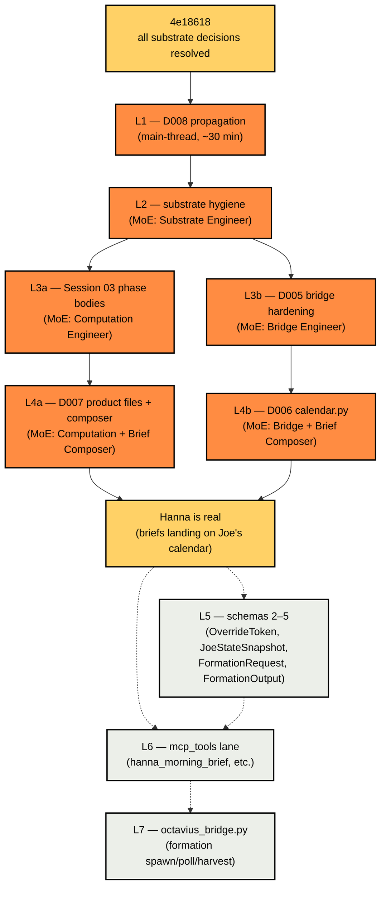

# Hanna buildout roadmap

**Date:** 2026-05-22
**Status anchor commit:** `4e18618` (whole-batch ratification of D005 + D007 + D008)
**Branch:** `claude/hanna-mcp-review-ZsorY`

This document is the single source of truth for the post-ratification buildout. It maps each unblocked implementation lane to its MoE roles per [D002](DECISIONS.md), names the files each lane touches, captures dependencies between lanes, and defines completion criteria. The [`hanna-dispatch-next`](../.claude/commands/hanna-dispatch-next.md) slash command reads §5 and dispatches the next unblocked lane.

---

## §1 Context

All eight substrate decisions are resolved as of `4e18618` (D001–D008). Six implementation lanes are simultaneously unblocked. The dominant cost driver has shifted from *deciding* to *sequencing discipline* — running disjoint lanes in parallel where the file graph allows, and tidying before building only where tidying genuinely unblocks downstream agents.

This roadmap operationalizes the discipline. It is not a backlog — every lane here is unblocked, MoE-role-assigned, and ready to dispatch. The roadmap is *finite*: after L4b lands, Hanna is a real always-on producer publishing briefs to Joe's calendar. Subsequent lanes (L5, L6, L7) are catalogued but live outside the immediate critical path.

---

## §2 Substrate decision tree (anchor)

| D-entry | Topic | Status |
|---|---|---|
| D001 | Rule 35 permissive reading of `coach` | resolved |
| D002 | MoE methodology for substrate work | resolved |
| D003 | Apache headers — drop per-file | resolved |
| D004 | Trailer hygiene at reviewer + conventions layers | resolved |
| D005 | Harlo bridge hardening (3 sub-decisions) | resolved (whole-batch) |
| D006 | Calendar event v1 delivery channel | resolved |
| D007 | Per-product `.md` input surface MVS (6 sub-decisions) | resolved (whole-batch) |
| D008 | §4 inheritance ratification (7 sub-decisions) | resolved (whole-batch) |

All ratified. The roadmap below executes against ratified ground.

---

## §3 Lane DAG



**Reading the DAG.** Solid arrows are hard dependencies (the upstream lane must land before the downstream lane starts). Dashed arrows are soft ordering (post-real lanes that don't block each other architecturally). L3a||L3b run in parallel; L4a||L4b run in parallel. Each parallel pair touches disjoint files except for `src/schemas.py`, where L4a owns `BriefPayload` + `ProductFile` and L4b owns `CalendarEventId` — main-thread integration merges both into the single file per the D002 step 5 integration pattern.

---

## §4 Per-lane spec

### L1 — D008 propagation

**Goal.** Propagate the D008 ratification into `HANNA_BLUEPRINT.md` §4 table, §5 "New Hydra delegate" / "New stage prims" sections, §10 lane diagram; update `README.md` lane mermaid; annotate non-active rules in `RULES.md` per D008.7.

**MoE roles.** Main-thread only (substrate-decision class per D002 — no MoE).

**Files touched.** `HANNA_BLUEPRINT.md`, `README.md`, `RULES.md`.

**Dependencies.** None — anchor is `4e18618`.

**Completion criteria.**
- `HANNA_BLUEPRINT.md` §4 table: "Audit status" column renamed to "Decision (D008)"; per-row values reflect ratification; "(pending ratification)" tags dropped.
- `HANNA_BLUEPRINT.md` §5 "New Hydra delegate" + "New stage prims" sections struck through or annotated as Cut per D008.1 / D008.2.
- `HANNA_BLUEPRINT.md` §10 lane diagram: `delegate` lane removed; `stage` lane reduced to SQLite tables; Rust crates / XGBoost / dual venv lanes removed.
- `README.md` lane mermaid: matches §10 updates.
- `RULES.md`: each non-active rule annotated "Not yet load-bearing — applies on the session that lands the constrained component" per D008.7 + BLUEPRINT §13.

**Effort.** ~100 lines docs, ~30 minutes main-thread.

**Brief skeleton (no MoE — main thread executes).** Run the propagation as a single docs commit; subject `docs(blueprint): propagate D008 ratification — Cut six lanes; Review the 33 rules`.

---

### L2 — Substrate hygiene

**Goal.** Close the "Bypassing any layer fails CI" aspirational gap (`RULES.md:185`); eliminate `PYTHONPATH=.` fragility; gate rule violations as CI failures.

**MoE roles.** Substrate Engineer + Compliance Reviewer.

**Files touched.**
- `pyproject.toml` (new) — Hanna package metadata; Python ≥3.12; pytest as dev-extra; src-layout (`src/` is the package root); ruff or no linter (Substrate Engineer's call).
- `.gitignore` — add `data/*.sqlite` (per [`REVIEW_2026-05-22.md`](REVIEW_2026-05-22.md) §3.2) + `data/products/*.private.md` (per D007.6).
- `tests/conftest.py` (new) — sys.path setup so `python3 -m pytest tests/` works without `PYTHONPATH=.`.
- `.github/workflows/ci.yml` (new) — runs pytest + the `RULES.md` lines 219–234 compliance greps as a failing step on any violation.

**Dependencies.** L1 (clean BLUEPRINT § references in CI step descriptions).

**Completion criteria.**
- `python3 -m pytest tests/` (no PYTHONPATH prefix) passes 10/10 from a clean shell.
- `python3 scripts/first_hanna_brief.py` (no PYTHONPATH prefix) runs end-to-end.
- `gh pr checks` (or local `act` equivalent) shows the ci.yml workflow passing on the branch.
- `data/hanna.sqlite` and `data/products/*.private.md` paths are gitignored.

**Effort.** ~250 lines (pyproject + workflow + conftest + .gitignore patch), ~1 session.

**MoE brief skeleton.**

> Substrate Engineer expert: author `pyproject.toml` with src-layout (`src/` as the package root, so `from src.X import Y` continues to work without code changes); pytest in `[project.optional-dependencies].dev`; Python `>=3.12` requirement. Author `.github/workflows/ci.yml` that installs the project + runs pytest + runs the RULES.md lines 219–234 compliance greps as failing steps. Author `tests/conftest.py` with `sys.path.insert(0, str(Path(__file__).resolve().parent.parent))` for path setup. Patch `.gitignore` for `data/*.sqlite` and `data/products/*.private.md`. ≤250 net lines.
>
> Compliance Reviewer: audit per D002 final-reviewer protocol — confirm pytest runs without PYTHONPATH, ci.yml runs the greps, no commits skip hooks, attribution trailers preserved on cloned files.

---

### L3a — Session 03 phase bodies

**Goal.** Land the six remaining `NotImplementedError("Session 03")` branches in `src/computations/compute_producer_phase.py`; expand tests from 10 to ≥21 cases per CONVENTIONS §1; delete the now-unreachable `NotImplementedError` catch in the PoC.

**MoE roles.** Computation Engineer + Compliance Reviewer.

**Files touched.**
- `src/computations/compute_producer_phase.py` — fill in lines 31–41 with real returns for MONTHLY, WEEKLY_MONDAY, WEEKLY_FRIDAY, MORNING, MIDDAY, EVENING; resolve `prev_phase` (likely: unused, no hysteresis at v1; document with a one-line comment); resolve holiday/half-day handling (likely: defer with a documented stance, no calendar lookup at v1).
- `tests/computations/test_compute_producer_phase.py` — expand to ≥21 cases (≥3 per branch per CONVENTIONS §1).
- `scripts/first_hanna_brief.py:53–54` — delete the `try/except NotImplementedError` catch (now unreachable).

**Dependencies.** L2 (clean test runner).

**Completion criteria.**
- `python3 -m pytest tests/computations/ -v` passes ≥21 tests; six new phase-branch tests, each with ≥3 cases (boundary + interior + adjacent per CONVENTIONS §1).
- The PoC at `scripts/first_hanna_brief.py` runs end-to-end without the `NotImplementedError` catch; main_thread integration verifies the `_phase_now()` body now reads as a direct `compute_producer_phase` call without exception handling.
- `prev_phase` is unused (annotated) or used (with a clear hysteresis rationale).

**Effort.** ~150 lines code + tests, ~1 session.

**MoE brief skeleton.**

> Computation Engineer expert: fill in six phase branches per BLUEPRINT §7 phase machine. MONTHLY when `now.day == monthly_day`; WEEKLY_MONDAY when `now.weekday() == 0 and now.hour == weekly_monday_hour`; WEEKLY_FRIDAY when `now.weekday() == 4 and now.hour == weekly_friday_hour`; MORNING when `now.hour < morning_end_hour`; MIDDAY when `now.hour < midday_end_hour`; EVENING fall-through. All returns are `ProducerPhase` enum values. `prev_phase` unused at v1 (annotate). No hysteresis. No holiday handling (deferred).
>
> Rewrite each of the six stub tests in `tests/computations/test_compute_producer_phase.py` into ≥3 tz-aware cases per branch (boundary + interior + adjacent). Total test count lands at ≥22 (the 4 lockout cases + ≥18 new phase-branch cases).
>
> Delete the `try/except NotImplementedError` catch at `scripts/first_hanna_brief.py:53–54` since the inner call no longer raises. The `_phase_now()` body becomes a direct `compute_producer_phase` call.
>
> Compliance Reviewer: audit per D002 final-reviewer protocol — confirm ≥21 tests pass, no inline phase logic outside `compute_producer_phase`, trailer hygiene, no Rule 36 voice drift.

---

### L3b — D005 bridge hardening

**Goal.** Land the three ratified D005 resolutions in `src/harlo_bridge.py`.

**MoE roles.** Bridge Engineer + Compliance Reviewer.

**Files touched.**
- `src/harlo_bridge.py` — three changes:
  - **D005.1.** Replace `_coach_driven` boolean with `begin_composition()` / `end_composition()` scope methods. Per-composition gate that resets on each `begin_composition`.
  - **D005.2.** Wire `_read_frame` to use the `timeout` parameter via `selectors.DefaultSelector` + `select(timeout=…)`.
  - **D005.3.** Add background `threading.Thread` drainer reading `proc.stderr` into a `collections.deque(maxlen=64)` ring buffer; expose `last_stderr()` accessor.
- `tests/test_harlo_bridge.py` (new) — covers all three.

**Dependencies.** L2 (clean test runner).

**Completion criteria.**
- `python3 -m pytest tests/test_harlo_bridge.py -v` passes with ≥9 tests (3 per sub-decision).
- A long-lived `HarloBridge` instance can compose multiple briefs without raising `HarloCoachingExchangeAlreadyDriven` (D005.1).
- A hung subprocess raises `HarloTimeout` (new exception) after the timeout, instead of blocking (D005.2).
- A subprocess writing >64KB to stderr does not deadlock the bridge (D005.3).

**Effort.** ~80 lines code in bridge + ~150 lines tests, ~1 session.

**MoE brief skeleton.**

> Bridge Engineer expert: implement the three D005 resolutions per the ratifications in `docs/DECISIONS.md` D005.
>
> D005.1: Replace `_coach_driven: bool = False` with `_composition_active: bool = False`. Add `begin_composition()` (asserts not currently active; sets active=True) and `end_composition()` (asserts currently active; sets active=False). `_coach` raises `HarloCoachingExchangeOutsideComposition` if `not _composition_active`; raises `HarloCoachingExchangeAlreadyDriven` only if called twice within one composition. Update `drive_coaching_exchange` to call `begin_composition` / inner / `end_composition` for backward compat with the current PoC.
>
> D005.2: In `_read_frame`, replace blocking `proc.stdout.readline()` + `proc.stdout.read(content_length)` with a `selectors.DefaultSelector` poll on `proc.stdout` with `select(timeout=…)`. Raise `HarloTimeout` if no data within timeout.
>
> D005.3: In `__enter__`, spawn a background `threading.Thread(daemon=True, target=_drain_stderr)` that loops reading lines from `proc.stderr` into a `collections.deque(maxlen=64)` instance variable `_stderr_ring`. Expose `last_stderr() -> list[str]` returning a snapshot. Stop the thread on `__exit__` / `close()`.
>
> Author `tests/test_harlo_bridge.py` (new) with ≥9 cases: 3 per sub-decision. Use `unittest.mock` to simulate the Harlo subprocess; for D005.3, write >64KB to stderr in a mock and verify no deadlock.
>
> Compliance Reviewer: audit per D002 final-reviewer protocol — confirm tests pass, no Rule 35 violations (`store|stage_reload|resolve_verifications|trigger_cognitive_recalibration` grep returns 0), trailer preserved on the cloned bridge file, no leaked threads from `__exit__`.

---

### L4a — D007 product files + composer rewrite

**Goal.** Replace the fictional brief composer text at `scripts/first_hanna_brief.py:95–104` with real state-aware composition reading per-product `.md` files. Land the four initial product file stubs, the `ProductFile` schema, and the `compute_brief_priority` pure function.

**MoE roles.** Computation Engineer + Brief Composer + Compliance Reviewer.

**Files touched.**
- `data/products/harlo.md` (new — empty stub with the ratified YAML frontmatter + sections per D007).
- `data/products/octavius.md`, `data/products/moneta.md`, `data/products/comfy_cozy.md` (new — same shape).
- `src/schemas.py` — add `ProductFile` dataclass (frontmatter fields + parsed sections); add `BriefPayload` dataclass (the composer's structured return: `phase`, `composed_at_iso`, `body_markdown`, `referenced_products: list[str]`).
- `src/computations/compute_brief_priority.py` (new) — pure function `compute_brief_priority(products: list[ProductFile], phase: ProducerPhase) -> list[str]` returning ranked product names per the "deadline within 5 working days × in-flight product count" heuristic.
- `scripts/first_hanna_brief.py` — composer rewrite: read product files via `Path.read_text`, parse YAML frontmatter + sections, call `compute_brief_priority`, render the brief.
- `tests/computations/test_compute_brief_priority.py` (new) — ≥3 cases per CONVENTIONS §1.
- `tests/test_schemas.py` (new) — `ProductFile` and `BriefPayload` parse / construct cases.

**Dependencies.** L3a (the brief composer needs the phase machine to be total — the current PoC fallback to MORNING goes away).

**Completion criteria.**
- `python3 scripts/first_hanna_brief.py` runs end-to-end, reads the four product files, produces a brief that mentions at least one product name from the files (no fiction).
- `python3 -m pytest tests/computations/test_compute_brief_priority.py tests/test_schemas.py -v` passes with ≥6 tests total.
- The brief composer text at `scripts/first_hanna_brief.py:82–104` no longer carries the fictional "the open lanes from yesterday's session..." text.

**Effort.** ~200 lines, ~1–2 sessions.

**MoE brief skeleton.**

> Computation Engineer + Brief Composer experts in parallel.
>
> Computation Engineer: define `ProductFile` and `BriefPayload` in `src/schemas.py` matching D007's ratified shape (frontmatter: `product` / `status` / `last_review_iso`; sections: Status, Blockers, Approaching forcing functions, Notes). Define `compute_brief_priority(products, phase) -> list[str]` as a pure function ranking product names by the heuristic in [`REVIEW_2026-05-22.md`](REVIEW_2026-05-22.md) §3.6: deadline-within-5-days × in-flight-count. Author tests at `tests/computations/test_compute_brief_priority.py` and `tests/test_schemas.py` with ≥3 cases per going-live function.
>
> Brief Composer: author the four `data/products/{name}.md` stubs with the ratified shape and empty Status/Blockers/Approaching/Notes sections (per D007.3 "empty stubs ship"). Rewrite `_compose_brief` in `scripts/first_hanna_brief.py` to: (1) read the four product files, (2) parse YAML frontmatter + section bodies, (3) call `compute_brief_priority`, (4) render the brief using the ratified Rule 36 voice — observation, not prescription; surface, not decide. The render must mention at least one real product by name (no fiction).
>
> Compliance Reviewer: audit per D002 final-reviewer protocol — confirm Rule 36 voice (no directives), no Rule 35 violations, BriefPayload + ProductFile schemas are fresh seeds (no attribution trailer per D004 §B), brief composer text grounded in product file data.

---

### L4b — D006 calendar.py

**Goal.** Land the D006 Calendar channel implementation: `src/channels/calendar.py` that publishes briefs to a dedicated `Hanna` iCloud calendar via `osascript Calendar`.

**MoE roles.** Bridge Engineer + Brief Composer + Compliance Reviewer.

**Files touched.**
- `src/channels/__init__.py` (new).
- `src/channels/calendar.py` (new) — `publish(brief: BriefPayload) -> CalendarEventId` (creates a 0-minute anchor event on the `Hanna` calendar with brief body in event notes); `archive(event_id: CalendarEventId) -> None` (moves the event to the `Hanna · Archive` calendar). Implementation via `subprocess.run(["osascript", "-e", script])` with AppleScript templates.
- `src/schemas.py` — add `CalendarEventId` (NewType alias on `str`).
- `tests/test_calendar.py` (new) — mocks `subprocess.run`; integration tests against a `Hanna · test` calendar guarded by an env var (`HANNA_INTEGRATION_TEST_CALENDAR=1`).
- `bin/hanna-brief.command` — Phase-2 swap target: replace the static-HTML `open` with `python3 -m src.channels.calendar publish-now` (the launcher now triggers a real calendar publish).

**Dependencies.** L4a (`BriefPayload` defined; brief composer produces it).

**Completion criteria.**
- `python3 -m pytest tests/test_calendar.py -v` passes with ≥6 mocked-subprocess tests (3 each for `publish` and `archive`).
- On a macOS host with Calendar.app set up, `python3 scripts/first_hanna_brief.py` publishes a real calendar event on the `Hanna` calendar (manual verification; integration test is gated on env var).
- `bin/hanna-brief.command` no longer opens the static HTML mockup; it triggers a real publish.

**Effort.** ~150–200 lines, ~1 session.

**MoE brief skeleton.**

> Bridge Engineer expert: implement `src/channels/calendar.py` with `publish(brief: BriefPayload) -> CalendarEventId` and `archive(event_id) -> None`. Use AppleScript via `subprocess.run(["osascript", "-e", template])` to author events on the dedicated `Hanna` calendar (assume the calendar exists; raise `HannaCalendarNotFound` with a helpful message if not). Event title format: `Hanna · {phase.name.lower()}`; body: `brief.body_markdown`; start time: brief.composed_at_iso; duration: 0 minutes (anchor event). Add `CalendarEventId = NewType("CalendarEventId", str)` to `src/schemas.py`.
>
> Brief Composer expert: ensure the brief body markdown renders correctly inside a calendar event note (per Apple Calendar's body-text constraints — no images, basic markdown, ≤1024 chars per event for safety). Test rendering locally if possible.
>
> Author `tests/test_calendar.py` with ≥6 mocked-subprocess cases. Guard integration tests on `HANNA_INTEGRATION_TEST_CALENDAR=1`.
>
> Update `bin/hanna-brief.command` Phase-2 swap target: replace `open "$BRIEF_PATH"` with `python3 -m src.channels.calendar publish-now`.
>
> Compliance Reviewer: audit per D002 final-reviewer protocol — confirm Rule 34 lockout check exists at the publish call site (no publish during FAMILY_LOCKOUT), Rule 35 — `src/channels/calendar.py` is a fresh seed (no trailer); `bin/hanna-brief.command` keeps its existing trailer.

---

### L5–L7 — future lanes (catalogued, not in the immediate critical path)

- **L5 — Schemas 2–5.** Add `OverrideToken`, `JoeStateSnapshot`, `FormationRequest`, `FormationOutput` to `src/schemas.py`. Each follows the `ProductFile` / `BriefPayload` pattern landed in L4a. Effort: ~1 session.
- **L6 — `mcp_tools` lane.** Author `python/hanna/mcp_server.py` with the `hanna_morning_brief`, `hanna_midday_check`, `hanna_evening_capsule`, `hanna_weekly_monday`, `hanna_weekly_friday`, `hanna_monthly`, `hanna_log`, `hanna_block`, `hanna_unblock`, `hanna_formation_request` tools. Each tool calls the composer + the Calendar channel. Depends on L4a + L4b + L5. Effort: ~2 sessions.
- **L7 — `octavius_bridge.py`.** Author the request-only bridge to Octavius (`spawn_formation` / `formation_status` / `formation_output`). Depends on Octavius source repo existing and L6 to have a caller. Effort: ~1 session.

---

## §5 Lane status table

This is the single source of truth the `/hanna-dispatch-next` slash command reads on each invocation. Status values: `queued` / `in-flight` / `done`. On lane completion, the slash command updates this table in the same commit as the lane's code.

| Lane | Status | Last commit | Unblocks |
|---|---|---|---|
| L1 — D008 propagation | **done** | `docs(blueprint): propagate D008 ratification (L1)` (this commit; see `git log --grep "L1"`) | L2 |
| L2 — Substrate hygiene | **done** | `feat(substrate): pyproject.toml + CI workflow + conftest + gitignore (L2)` (this commit; see `git log --grep "L2"`) | L3a, L3b |
| L3a — Session 03 phase bodies | queued | — | L4a |
| L3b — D005 bridge hardening | queued | — | L4b |
| L4a — D007 product files + composer rewrite | queued | — | L4b, L5 |
| L4b — D006 calendar.py | queued | — | L6 |
| L5 — Schemas 2–5 | queued | — | L6 |
| L6 — `mcp_tools` lane | queued | — | L7 |
| L7 — `octavius_bridge.py` | queued | — | (none) |

---

## §6 Harness invocation pattern

`/hanna-dispatch-next` is a slash command defined at [`.claude/commands/hanna-dispatch-next.md`](../.claude/commands/hanna-dispatch-next.md). Each invocation:

1. **Reads §5 above.** Identifies the topmost `queued` lane whose dependencies (from the lane's spec in §4) are all `done`.
2. **If no lane is unblocked**, reports the dependency graph state and stops.
3. **If the lane is main-thread** (e.g., L1, substrate-decision propagation), executes the work directly per the §4 brief skeleton.
4. **If the lane is MoE-eligible**, dispatches the named experts in parallel per D002 step 2 using the brief skeleton from §4; runs Compliance Reviewer last and alone per D002 step 4.
5. **Verifies completion criteria** from §4 (pytest counts, grep results, brief artifacts).
6. **Updates §5 status** in the same commit as the lane's code (from `queued` → `done`; updates `Last commit` column with the new SHA).
7. **Commits + pushes** per D002 step 6 (single commit per MoE execution).
8. **Outputs a one-paragraph summary** of what landed and the next unblocked lane.

The harness "closes the loop" via three mechanisms: (1) §5 is the single source of truth always synced with `HEAD`; (2) each lane's completion criteria are explicit and machine-verifiable; (3) after the commit, re-invocation advances to the next lane without context reload.

---

## §7 `/loop` pairing

For hands-off daily progress, pair the slash command with the [`loop`](https://docs.claude.com/en/docs/agent-sdk/skills/loop) skill:

```
/loop 24h /hanna-dispatch-next
```

This advances ~1 lane per day. The loop self-terminates when §5 shows all lanes `done` (the slash command's "no unblocked lane" branch).

For faster cadence (e.g., during a focused buildout sprint), `/loop 4h /hanna-dispatch-next` advances ~6 lanes per day if Joe is available to ratify MoE outputs.

---

## §8 Critical files (for the harness to read)

- This file (`docs/ROADMAP.md`) — §5 status table is the read target.
- [`docs/DECISIONS.md`](DECISIONS.md) — D001–D008 ratified decisions the lanes execute against.
- [`HANNA_BLUEPRINT.md`](../HANNA_BLUEPRINT.md) — architectural spec each lane respects.
- [`RULES.md`](../RULES.md) — 33 inviolable rules + 4 addenda; compliance gates.
- [`docs/CONVENTIONS.md`](CONVENTIONS.md) — test layout + trailer hygiene.
- [`docs/REVIEW_2026-05-22.md`](REVIEW_2026-05-22.md) — first-principles review backing the lane ordering.
- [`NEXT.md`](../NEXT.md) — session-state checkpoint; updated post each lane.

---

*Hanna surfaces. The director directs. The harness advances.*
