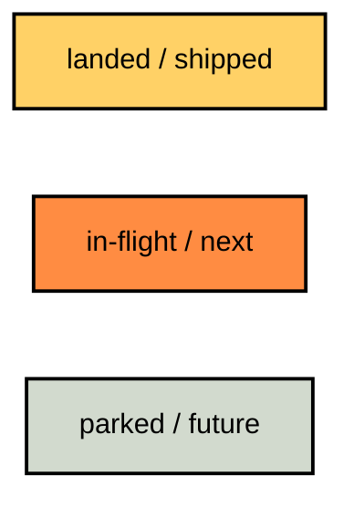
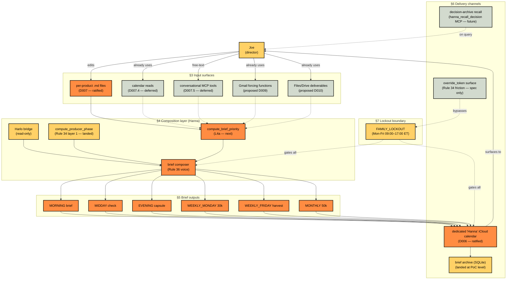
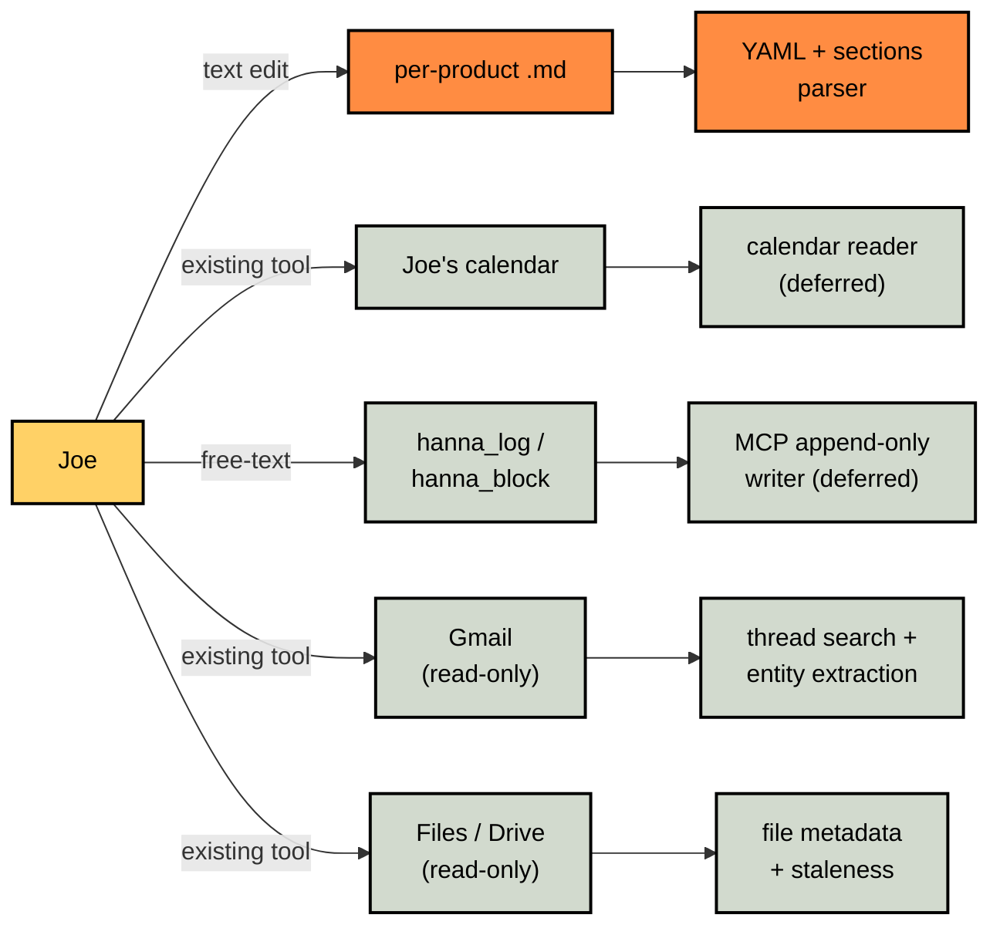
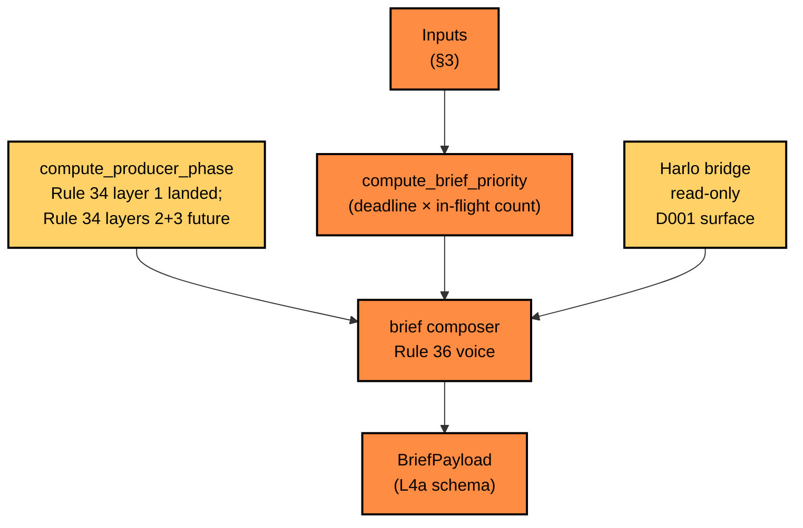
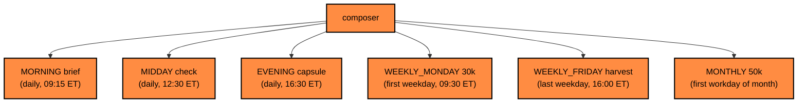
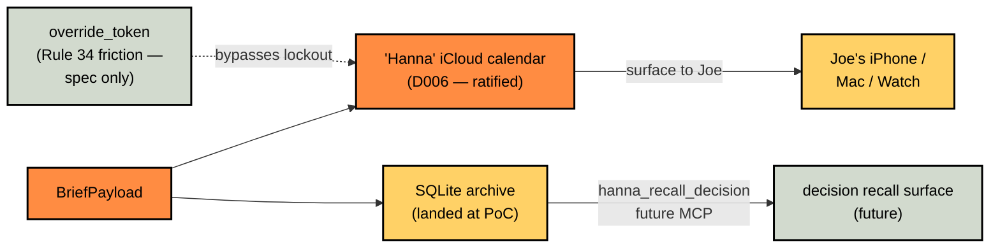

# UI/UX map — design exploration

**Date:** 2026-05-22
**Purpose:** A navigation map for future Claude design sessions. Joe hands a session this doc and says *"design the X feature"*; the session reads the map, finds the feature, sees its surrounding context, and proceeds. Each feature carries a status, a design source pointer, and the open design questions a future session would resolve.

This is a map, not a spec. Authoritative specs live in [`HANNA_BLUEPRINT.md`](../HANNA_BLUEPRINT.md), [`docs/DECISIONS.md`](DECISIONS.md), and [`RULES.md`](../RULES.md). This map points at them.

---

## §1 Design-vocabulary inheritance

Every feature on this map inherits visual vocabulary from two existing sources. Future design sessions should reach for these *first* before inventing.

### §1.1 From `web/templates/morning_brief.html` (the Phase-1 mockup)

- **Layout.** Container `max-width: 920px`, padding `96px 32px 200px`. Gutter `120px` (CSS var `--gutter`). Asymmetric two-column rhythm where used.
- **Typography.** Sans: **Manrope** (300–700). Mono: **JetBrains Mono** (400–700) — applied to numerics via `font-variant-numeric: tabular-nums`. Base 16px / line-height 1.7 / weight 500. Font features: `"kern" 1, "liga" 1, "calt" 1, "ss01" 1`.
- **Palette (7 functional colors, muted earth-cool).** `--sage #6B7E73` (primary action), `--blue #6E8893` (temporal/forcing), `--honey #9A8854` (info), `--clay #A0735D` (escalation — *never red*), `--lichen #7A8556` (complete), `--lavender #7E7D8E` (linked), `--stone #8B968F` (muted/parked). Background: `--bg #ECEFE9`, `--bg-elev #DFE5DD`, `--bg-inset #D2DACE`. Ink: `--ink #2D3B3D`, `--ink-soft #56625F`, `--muted #8B968F`. Rule dividers low-opacity: `rgba(45, 59, 61, 0.10)`.
- **Section vocabulary.** `.masthead` (header + version chip, `margin-bottom: 80px`), `.producer-note` (editorial framing callout, left-border), `.callout` (alert/info, 64×64 emoji icon + content grid), `.section` (major content block, `margin-top: 144px`), `.section-head` (title with underline rule).
- **Posture (per BLUEPRINT §5 line 213).** *"Restraint, no red, deliberate negative space, calm typography."* Rule 36 in visual form.

### §1.2 From the README mermaid diagrams

- **Diagram types.** `flowchart TB` or `flowchart LR` only. No `sequenceDiagram`, no `stateDiagram` in repo precedent.
- **Two-color status palette.** `fill:#FF8C42` (organic orange — next/in-flight). `fill:#FFD166` (earth yellow — landed/done). All nodes carry 2px black stroke (`stroke:#000000,stroke-width:2px`) and black ink (`color:#000000`).
- **Node shapes.** Rectangles only. Semantic meaning conveyed via label text, never via shape.
- **Arrows.** Solid `-->` for primary/hard flow; dashed `-.->` for design reference or async/soft signals. Labels on arrows are short — usually a condition or a time/state marker.

### §1.3 This map's additions

For status categories beyond the README's two-color set, this map adds one stone-muted shade for parked/future features so the visual hierarchy is preserved:



Light-stone `#D2DACE` matches the HTML mockup's `--bg-inset`. The added shade is the only deviation from the README precedent; if future design sessions want to constrain back to the two-color palette, parked features can be omitted from the diagrams entirely.

---

## §2 Master mermaid map

The full Hanna surface, organized as Joe → input → composition → output → channel → Joe loop.



**Reading the master map.** Each subgraph is one feature category. Solid arrows show primary data flow. Dashed arrows show deferred / future / soft signals. Color indicates status: yellow = landed, orange = next/in-flight, stone = parked/future.

The map's symmetry — Joe at top, Joe at bottom, Hanna in the middle — reflects the producer's stance. Joe drives the inputs; Hanna composes; the output surfaces to Joe. The loop is the producer's life cycle.

---

## §3 Input surfaces

Five input surfaces, two ratified and three deferred or proposed.



**Per-feature notes.**

- **Per-product `.md`** (next, L4a). YAML frontmatter (`product`, `status`, `last_review_iso`) + four sections (Status, Blockers, Approaching forcing functions, Notes). Initial set: `harlo`, `octavius`, `moneta`, `comfy_cozy`. **Design questions:** Is the YAML frontmatter visible to Joe (he edits it directly) or hidden behind a CLI? (Default: visible — Joe edits raw markdown.) Is there a `data/products/_TEMPLATE.md` for new products? Should the `status` enum extend beyond the four values?
- **Calendar reads** (deferred per D007.4). Read-only access to Joe's existing Google/Apple Calendar via the Calendar MCP. **Design questions:** Entity-extraction model — regex, LLM, hybrid? Forcing-function keywords per product — configured in the product `.md` frontmatter, or in a separate `data/keywords.yaml`?
- **Conversational MCP tools** (deferred per D007.5). `hanna_log`, `hanna_block`, `hanna_unblock`. **Design questions:** What does the tool's return look like — confirmation message, full updated `.md` body, silent? Should `hanna_log` accept a product name parameter or infer from content?
- **Gmail forcing-function detection** (proposed, see [`PRODUCER_LENS.md`](PRODUCER_LENS.md) §3.1). **Design questions:** How does the brief surface a Gmail-detected forcing function — as a candidate Joe ratifies in the `.md`, or auto-applied? (Default: candidate.) What's the surfacing voice — *"Gmail thread X mentions Y for product Z"* — or more compressed?
- **Files/Drive deliverables** (proposed, see [`PRODUCER_LENS.md`](PRODUCER_LENS.md) §3.2). **Design questions:** Drive-backing the `.md` files vs. mirror — which? How are stale deliverables surfaced — leading line, footer, separate section?

---

## §4 Composition layer (Hanna)

The composition pipeline: phase → priority → composer, with Harlo state as a side-input.



**Per-feature notes.**

- **`compute_producer_phase`** (landed for FAMILY_LOCKOUT; six other branches in L3a). **Design questions:** none — pure function with a known signature. Voice modulation per phase is a *composer* question, not a phase question.
- **`compute_brief_priority`** (next, L4a). Ranking heuristic: `(deadline_proximity × in_flight_count)`. **Design questions:** Cross-product blocker deduplication — single pass or separate function? Does the ranking respect Joe's manual override (`status: in_flight` weight bump) or is it purely time-based?
- **Harlo bridge** (landed; hardening in L3b). Provides `read_state`, `read_burnout_level`, `read_schedule`, `read_prediction`, `recall`, `query_past_experience`, `patterns`, `drive_coaching_exchange` per [D001](DECISIONS.md). **Design questions:** none new — the surface is ratified.
- **Brief composer** (next, L4a). Rule 36 voice. **Design questions** (the biggest open set in this doc):
  - Voice posture per phase: does MORNING feel different from EVENING? Different from MONTHLY?
  - Length envelope per phase: ≤200 / ≤500 / ≤1000 words by phase?
  - State-modulated voice: when Harlo state is RED, leading-line shift?
  - Cross-day persistence: stateless briefs vs. references to yesterday's open items?
  - Fiction-handling: if no product files exist, what does the brief say? (Currently the PoC produces fiction — L4a removes that.)

---

## §5 Brief outputs (six rhythms)

The six phase-keyed briefs Hanna composes. Each carries its own design questions.



**Per-brief design questions:**

- **MORNING brief.** Top of day; lead with portfolio rank + Joe state context. **Q:** Concision envelope (≤200 words?)? Does it open with state observation (RED/YELLOW/GREEN) or with the top-priority product? Does it always quote one product by name, or sometimes synthesize?
- **MIDDAY check.** Half-day pulse. **Q:** What's the *delta* from morning — what changed in 3.5 hours? Is the midday check skipped if no signal moved (silence is allowed)?
- **EVENING capsule.** Day-close. **Q:** Forward-looking ("tomorrow's top item") or backward-looking ("what landed today")? Both? In what order?
- **WEEKLY_MONDAY 30k.** Week-opener. **Q:** Broader than morning brief — includes parked products? Long-window forcing functions (≤30 days)?
- **WEEKLY_FRIDAY harvest.** Week-close. **Q:** Does it reference the briefs from Mon–Thu (mirror, per [`PRODUCER_LENS.md`](PRODUCER_LENS.md) §4.6)? Does it tee up the weekend handoff or stay strictly week-scoped?
- **MONTHLY 50k.** Month-opener. **Q:** Major lifecycle-stage shifts only? Does it surface the past month's decisions (D-entries) as part of the producer's why-trail?

Each brief shares the BriefPayload schema (L4a) but differs in *render template* and *length envelope*. The composer needs N phase-specific render paths.

---

## §6 Delivery channels



**Per-channel notes.**

- **Calendar event** (next, L4b). Dedicated `Hanna` iCloud calendar. 0-minute anchor events at rhythm times. Brief body in event notes (markdown). **Design questions:** Event color (Apple Calendar supports per-calendar tint)? Title format (`Hanna · morning` vs. `Hanna brief — morning` vs. just the phase name)? Body markdown: full brief, or summary with a Drive link to the full body? Calendar.app shows event notes truncated; does Hanna paginate?
- **SQLite archive** (landed at PoC level). `data/hanna.sqlite` table `briefs`. Already writes per `scripts/first_hanna_brief.py:107–115`. **Design questions:** Retention policy (forever, or rolled at N=1000)? Schema migration plan if BriefPayload evolves?
- **`hanna_recall_decision`** (future, post-mcp_tools lane). MCP tool that grep-searches `docs/DECISIONS.md`. **Design questions:** Return shape — full D-entry, summary, or pointer? Cross-link to the BLUEPRINT section the decision affects?
- **`override_token`** (parked, spec-only). HMAC-signed, single-use, TTL-bounded per [RULES.md:185](../RULES.md). **Design questions** (this is the biggest UX cliff Hanna hasn't crossed):
  - How does Joe *generate* the token? Slash command? CLI? In-Calendar event creation?
  - What does the *surfacing* look like — does the calendar event show "OVERRIDE — authorized 22:14 ET"?
  - What does *revocation* look like — Joe regrets a midnight session?
  - TTL — 1 hour, 1 working day, 1 calendar day?

---

## §7 Lockout boundary (Rule 34)

The architectural primitive. Three layers per BLUEPRINT §7.

```mermaid
flowchart LR
    classDef landed  fill:#FFD166,stroke:#000000,stroke-width:2px,color:#000000
    classDef next    fill:#FF8C42,stroke:#000000,stroke-width:2px,color:#000000
    classDef parked  fill:#D2DACE,stroke:#000000,stroke-width:2px,color:#000000

    Call["MCP tool call<br/>or scripted invoke"]:::next
    L1{"Layer 1<br/>compute_producer_phase"}:::landed
    L2{"Layer 2<br/>HdProducer delegate<br/>(D008.1 Cut — collapsed)"}:::parked
    L3{"Layer 3<br/>per-tool lockout check<br/>(future)"}:::parked
    NoOp["LockoutResponse<br/>structured no-op<br/>(schema future — L5)"]:::parked
    Pub["publish brief"]:::next

    Call --> L1
    L1 -->|FAMILY_LOCKOUT| NoOp
    L1 -->|active phase| L3
    L3 -->|lockout| NoOp
    L3 -->|publish| Pub
    L2 -.-|"D008.1 Cut: layer 2<br/>collapses into layer 3"|.- L3
```

**Per-feature notes:**
- **Layer 1** (landed). `compute_producer_phase` returns `ProducerPhase.FAMILY_LOCKOUT` enum.
- **Layer 2** (Cut per D008.1). Originally Hydra-delegate-routed. Collapsed into Layer 3 per the D008 ratification. **Design questions:** none — this layer is gone.
- **Layer 3** (future). Per-tool lockout check in the `mcp_tools` lane. **Design questions:** Each tool calls `compute_producer_phase` at top? Shared helper? Decorator pattern?
- **`LockoutResponse`** (future, L5). Schema TBD. Shape proposal in [`SESSION_01_RECON.md`](SESSION_01_RECON.md):185: `{status, phase, next_window_iso, override_path}`. **Design questions:** Field shape exactly? `override_path` is a URL, a slash command name, or a UX-agnostic identifier?

---

## §8 Cross-cutting features (not on the master map)

Features that span multiple layers and deserve their own design attention.

### §8.1 The brief composer's *voice*

Not a feature but a discipline. Per Rule 36, the voice is observation, not directive. Future Claude design sessions should: read the existing brief composer text at `scripts/first_hanna_brief.py:82–104`; note the voice patterns ("Across the portfolio…", "Approaching this morning…", "Surfacing this as observation"); and propose either preservation or refinement.

The L4a composer rewrite replaces the fiction text with state-aware text but should preserve the voice posture.

### §8.2 The brief's *layout* inside a Calendar event

A Calendar event's notes field renders plain text with limited markdown. The brief body must respect this. **Design questions:** Plain-text-only? Markdown but no images? Headings via `#` syntax — supported? Lists via `-` — supported? The Phase-1 HTML mockup's typography (Manrope + JetBrains Mono) does NOT transfer to a Calendar event; what *does* transfer is the *posture* (calm, restraint, deliberate negative space → translated as: terse, well-spaced, no exclamation marks).

### §8.3 The HTML mockup's role post-D006

Per D006, the destination is Calendar, not browser. So what is `web/templates/morning_brief.html` for now?

**Two roles preserved:**
1. **Design reference.** The HTML carries the editorial canvas (typography, palette, posture) that the brief composer voice should embody, even when rendered in a Calendar event note. Future design sessions read the HTML to understand the *feel*, then translate to whatever channel.
2. **Phase-1 launcher.** `bin/hanna-brief.command` opens the HTML in a browser. Once L4b lands, the launcher's Phase-2 swap target replaces this with a real calendar publish. The HTML mockup stays in the repo as a referenced design artifact.

**One role removed:** the HTML is *not* the production destination. The Phase-1 mockup's 920px asymmetric grid does not transfer to Calendar.

### §8.4 The decision archive as a surfaceable artifact

`docs/DECISIONS.md` is itself a UX surface, accessed via the future `hanna_recall_decision` MCP tool. The brief composer can also reference D-entries inline: *"Per D006, today's brief lands on the Hanna calendar — open it on your iPhone for cross-device access."* **Design questions:** When does the composer cite a D-entry vs. stay silent? Citation format (full D-number, or "per the channel decision")?

---

## §9 How Claude design sessions use this map

**Protocol for any design session:**

1. **Read this file (§1–§7).** Understand the inheritance, the master map, and the per-feature catalog.
2. **Identify the target feature.** Joe says *"design X"*; X is somewhere on the map. Find it.
3. **Read the feature's status and design questions.** §3–§8 catalog them.
4. **Read the authoritative source.** Each feature points at [`HANNA_BLUEPRINT.md`](../HANNA_BLUEPRINT.md), [`docs/DECISIONS.md`](DECISIONS.md), [`RULES.md`](../RULES.md), or [`docs/PRODUCER_LENS.md`](PRODUCER_LENS.md). Read what's referenced.
5. **Make the design contribution.** Propose UX, mockups, or a draft D-entry. Stay in the existing visual vocabulary (§1) unless explicitly extending it.
6. **Update this map.** When a design question is resolved, mark it in §3–§7 (status update, question struck through, pointer to the new D-entry).

**What design sessions should *not* do:**

- Invent visual vocabulary from scratch. The HTML mockup + README mermaid set is the inheritance.
- Skip the design questions. Each feature has questions because they're real ambiguities. Surface them; don't paper over.
- Cross Rule 34 / Rule 35 / Rule 36 / Rule 37. The rules are inviolable; design that violates a rule is not a design solution.

---

## §10 Map maintenance

This map is itself a living artifact. After each lane lands per [`docs/ROADMAP.md`](ROADMAP.md), the matching feature here updates its status (`next` → `landed`, `parked` → `next` if a follow-on D-entry opens it, etc.). The status updates land in the same commit as the lane's code.

Future major features that don't yet exist on the map (e.g., new MCP integrations beyond Gmail/Files, new brief phases beyond the six) get added as new subgraphs with `parked` status until a D-entry promotes them.

---

## §11 Cross-references

- [`HANNA_BLUEPRINT.md`](../HANNA_BLUEPRINT.md) — architectural spec.
- [`RULES.md`](../RULES.md) — 33 inviolable rules + 4 producer addenda.
- [`docs/DECISIONS.md`](DECISIONS.md) — D001–D008 ratified decisions.
- [`docs/CONVENTIONS.md`](CONVENTIONS.md) — test layout + trailer hygiene.
- [`docs/REVIEW_2026-05-22.md`](REVIEW_2026-05-22.md) — first-principles review.
- [`docs/PRODUCER_LENS.md`](PRODUCER_LENS.md) — work-task-management thinking that feeds this map's input surface section.
- [`docs/ROADMAP.md`](ROADMAP.md) — buildout lane DAG that promotes features on this map.
- [`web/templates/morning_brief.html`](../web/templates/morning_brief.html) — design vocabulary source.
- [`bin/hanna-brief.command`](../bin/hanna-brief.command) — Phase-1 launcher; Phase-2 swap target named in L4b.

---

*Design is the discipline of restraint. The map shows what exists, what's queued, what's parked — and what questions a future session would resolve. Joe directs; the map points.*
